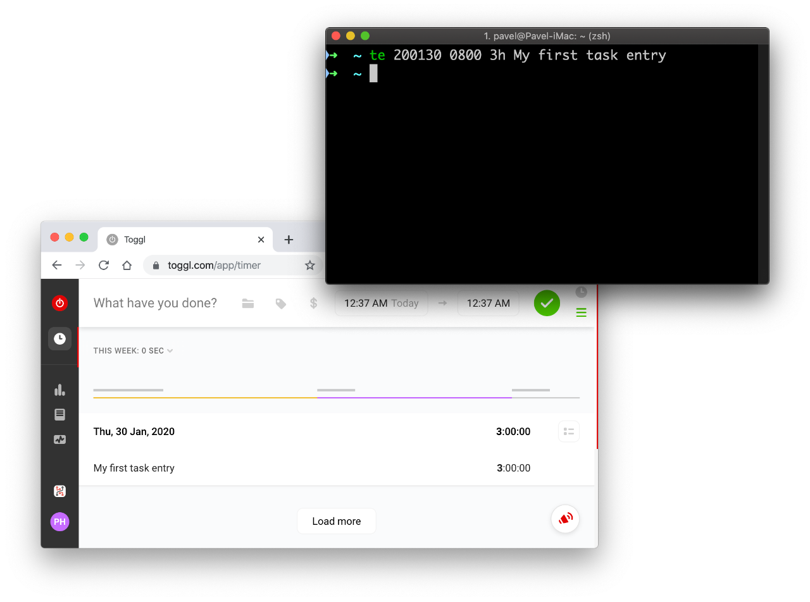

# Toggl Entry (te)

Toggle Entry (te) is a Toggl REST API command line interface (CLI) client. This tool allows quick entries insertion from your terminal - no more tedious mouse-clicking!

For any power user, this will be probably much faster way than inserting entries with the official web/desktop/mobile version of the app. Moreover, it can nicely speed-up bulk editing via shell script edited in your favorite editor. Actually, this is how I am catching up with my timesheets ;-)

## Requirements

* Windows, macOS, Linux, or any Unix-like operating system
* Python 3 + pip (tested with Python 3.7)
* Toggl account + Toggl API token

> You can get the Toggl API token in its web interface from **Profile Settings** (scroll to the bottom).

## Installation

1. Install `te` from PyPI (Python Package Index):

       $ pip3 install te

1. Create a configuration file `.te.ini` in your home directory:

       $ touch ~/.te.ini

1. Set permissions to your configuration file, so nobody but you can read it:

       $ chmod 0600 ~/.te.ini

1. Open the configuration file:

       $ nano  ~/.te.ini

1. Insert this template to the configuration file:

       [general]

       ; Set your timezone here
       timezone = Europe/Prague

       ; Set your API token here
       api_token = ...

1. Adjust the `timezone` and `api_token` in the configuration file and save it.

## Usage

Open your terminal application and try this command:

    $ te 20-01-30 08:00 1h My first task entry

> If no error message is provided and the process gracefully exits, the entry has been successfully inserted. You can check it in the Toggl web app.

You can also use this format to automatically insert the current date:

    $ te - 08:00 120m My first task entry

Also, the separators can be avoided:

    $ te 200130 0800 3h My first task entry

That's it for now and happy Toggl-ing!

## Contributing

Please read [**CONTRIBUTING.md**](https://github.com/hubpav/te/blob/master/CONTRIBUTING.md) for details on our code of conduct, and the process for submitting pull requests to us.

## Versioning

We use [**SemVer**](https://semver.org/) for versioning. For the versions available, see the [**tags on this repository**](https://github.com/hubpav/te/tags).

## Authors

* [**Pavel Hübner**](https://github.com/hubpav) - Initial work

## License

This project is licensed under the [**MIT License**](https://opensource.org/licenses/MIT/) - see the [**LICENSE**](https://github.com/hubpav/te/blob/master/LICENSE) file for details.
